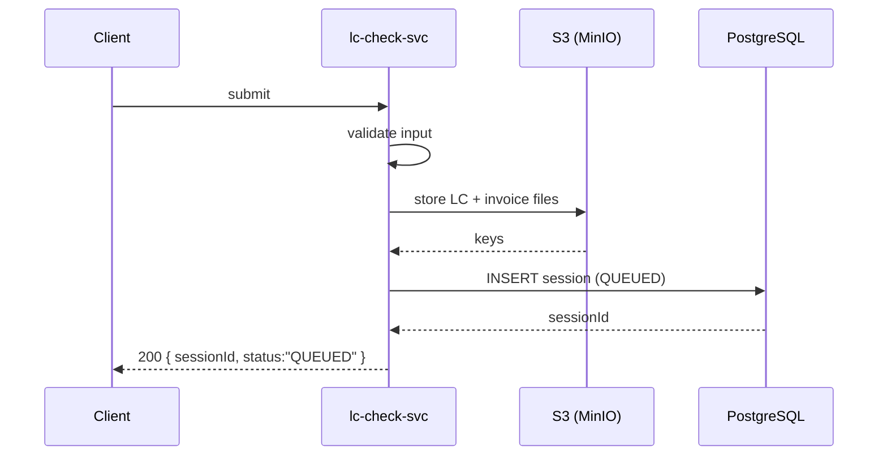
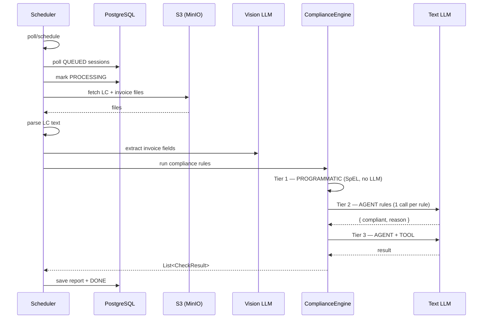
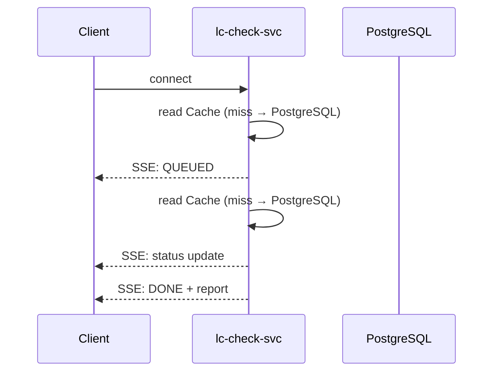

# LC Invoice Checker — Solution Document

---

## Major Considerations

#### **Output Accuracy**

Accuracy is the most important consideration. Any missed issue means immediate financial loss — LC funds go to the beneficiary and cannot be recovered.

Hence each stage of **LLM agent output must be right.** Human review remains the final gate as LLM didn't reach that stage yet.

#### **Workload Decoupling**

Banks have 5 days to check LC and invoice. But document submission can happen anytime, in any volume. Also the LLM inference engine have capacity and limits processing paralel request.

So **decouple submission from processing is needed.** This lets the system scale freely without concurrency failures.

#### **Observation Capability**

The vision and language models are black boxes to us. We need to see what goes in and what comes out. That visibility is how we close the accuracy gap. Frameworks like SpringAI, LangChain are convenient — but they hide the details.

We still need to **inspect the raw LLM API request and response** for judging and tuning LLM Performance.

## Workflow

#### 1. Task Submission

**API:** `POST /api/v1/lc-check/start` — submit LC text + invoice PDF, get sessionId immediately

#### 2. LC Check Pipeline

**API:** async scheduler — polls queue, runs compliance checks, saves report

#### 3. Progress and Status Inquiry (SSE)

**API:** `GET /api/v1/lc-check/{sessionId}/stream` — live SSE stream of status and result

## Key Step as Configuration

LC mt700 text parsing:

Invoice Fields Extract

UCP600, ISBP821 Rule Check

## Solution Architecture

## Performance and Optimization

1. Overall performance
2. Vision Model for Invoice Extration
3. Text Model for Rule Check
4. Cost
