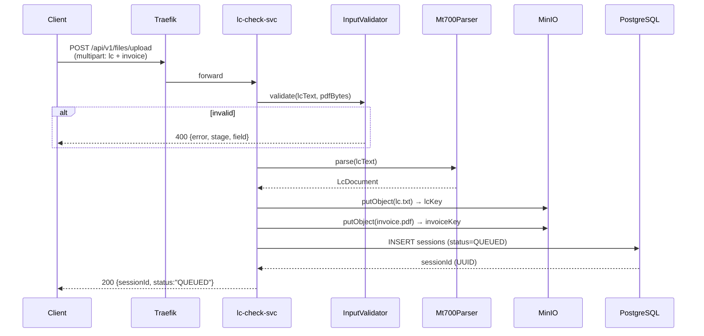
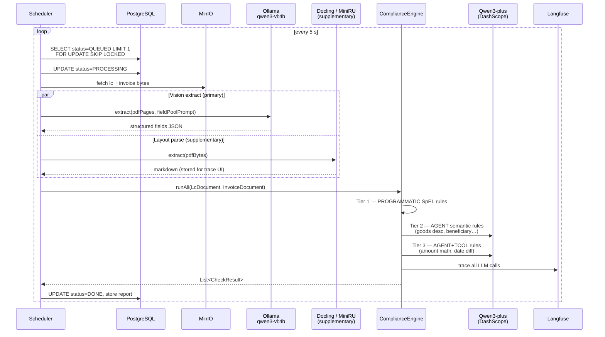
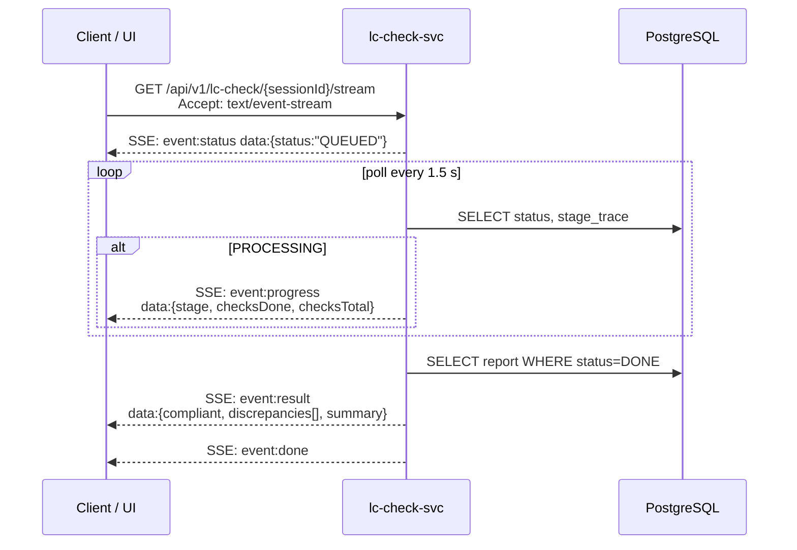

# LC Invoice Checker

An automated **Letter of Credit compliance checker** built for the AI Engineer take-home assessment. Accepts a SWIFT MT700 LC (plain text) and a commercial invoice (PDF), checks the invoice against UCP 600 / ISBP 821 rules, and returns a structured JSON discrepancy report.

> **Assessment spec:** [`docs/refer-doc/AI-Engineer-test-case-v2.txt`](docs/refer-doc/AI-Engineer-test-case-v2.txt)
> **Logic SoT:** [`docs/refer-doc/logic-flow.md`](docs/refer-doc/logic-flow.md)
> **Rule reference:** [`docs/refer-doc/ucp600_isbp821_invoice_rules.md`](docs/refer-doc/ucp600_isbp821_invoice_rules.md)

---

## Purpose & Design Focus

Trade Finance compliance officers manually verify every invoice against an LC before authorising payment — a process that is slow, expensive, and error-prone. This service automates the verification pipeline end-to-end:

| What | How |
|---|---|
| MT700 parsing | Pure regex state-machine — zero LLM, deterministic, auditable |
| Invoice extraction | Vision-LLM (qwen3-vl:4b local / Qwen3-plus cloud) reads PDF pages directly as images |
| Rule checks | Three tiers: SpEL code → single-LLM agent → LLM agent + Java tool callbacks |
| Observability | Every LLM call traced in Langfuse with session tag, latency, and token counts |
| Modularity | New rules = one row in `catalog.yml`, new MT700 tags = one row in `lc-tag-mapping.yaml` |

**Design principle:** LLM lives in Java (Spring AI) only. Python extractors (Docling, MiniRU) are pure layout parsers — no prompts.

---

## Architecture

### Deployment Topology

```
Internet
  └── lccheck.moments-plus.com  (Cloudflare DNS)
        └── Cloudflare Tunnel  (zero-trust, no open inbound ports)
              └── Ubuntu Server ───────────────────────────────────────────────────┐
                    │                                                               │
                    ├── Traefik :443        (TLS termination, host routing)         │
                    ├── Auth Service        (API key / JWT validation)              │
                    │                                                               │
                    ├── lccheck-ui :80      (Vite + nginx, Docker)                 │
                    ├── lc-check-svc :8080  (Spring Boot 3.5, Docker)              │
                    │       │                                                       │
                    │       ├── PostgreSQL :5432  (session queue + results)        │
                    │       ├── MinIO :9000        (LC text + invoice PDF store)   │
                    │       ├── Langfuse :3000     (LLM trace dashboard)           │
                    │       │                                                       │
                    │       ├── docling-svc :8081  (supplementary layout parse)    │
                    │       ├── mineru-svc :8082   (supplementary layout parse)    │
                    │       └── Ollama :11434      (local LLM, primary path)       │
                    │               ├── qwen3-vl:4b  (vision — PDF extraction)     │
                    │               └── qwen3:7b     (text — rule agent checks)    │
                    │                                                               │
                    └── Qwen3-plus (DashScope cloud) ← Tier 2/3 agent rules ───────┘
```

**Architecture diagram (Excalidraw):** [`docs/diagrams/architecture.excalidraw`](docs/diagrams/architecture.excalidraw)

### Component Map

| Component | Tech | Role |
|---|---|---|
| `lc-check-svc` | Java 21 + Spring Boot 3.5 + Spring AI 1.1 | Pipeline orchestration, rule engine, REST API, SSE streaming |
| `lccheck-ui` | Vite + nginx | Upload form, compliance result viewer, source drawer |
| `docling-svc` | Python FastAPI + Docling | PDF layout → markdown (supplementary, stored for trace) |
| `mineru-svc` | Python FastAPI + MagicPDF | PDF layout → markdown (supplementary, stored for trace) |
| Ollama | Local LLM server | qwen3-vl:4b primary vision extractor; qwen3:7b rule agent |
| Qwen3-plus | Alibaba DashScope API | Cloud fallback / primary for complex agent rule chains |
| PostgreSQL 16 | Docker | Session state, queue (QUEUED → PROCESSING → DONE), result JSON |
| MinIO | Docker | Object storage for uploaded LC text + invoice PDF files |
| Langfuse | Docker | LLM observability — prompts, responses, latency, tokens per session |
| Traefik | Docker | Reverse proxy, TLS termination, route-by-Host |

---

## Prerequisites

| Requirement | Version / Notes |
|---|---|
| Docker + Compose | 24+ |
| JDK 21 | Temurin recommended (`sdk install java 21-tem`) |
| Ollama | `brew install ollama` — pull `qwen3-vl:4b` and `qwen3:7b` |
| Python 3.12 + uv | Only if running Docling / MiniRU locally |
| Alibaba DashScope key | For Qwen3-plus cloud agent calls (`CLOUD_LLM_VL_API_KEY`) |
| Cloudflare Tunnel token | For public deployment (`CF_TUNNEL_TOKEN`) |

```bash
# Pull local LLM models
ollama pull qwen3-vl:4b     # vision — invoice PDF extraction
ollama pull qwen3:7b        # text — semantic rule agent checks
```

---

## Solution Diagram

### API Flow Overview

Three independent flows compose the async pipeline:

```
[Client] ──1── POST /upload ──▶ [MinIO + PostgreSQL] ──▶ sessionId
                                      │
                   [Scheduler polls]──2──▶ [Extract → Check → Store]
                                      │
[Client] ──3── GET /stream (SSE) ◀────┘ live progress + final report
```

Full PlantUML source: [`docs/diagrams/`](docs/diagrams/)

---

### Flow 1 — Upload & Session Creation



---

### Flow 2 — Async Compliance Processing



---

### Flow 3 — SSE Result Streaming



---

## Key Configuration Files

Three YAML files drive the pipeline. Changing a rule, adding an MT700 tag, or adjusting an invoice field alias requires **no Java code change**.

### `lc-tag-mapping.yaml` — MT700 Parser

Maps every SWIFT tag (`:20:`, `:32B:`, `:45A:`…) to canonical field keys and selects the parsing strategy.

```yaml
# One row = one MT700 tag
"32B": { field_keys: [credit_currency, credit_amount],
         parser: AMOUNT_WITH_CURRENCY,
         mandatory: true,
         validation: { pattern: "^[A-Z]{3}[0-9.,]+$" } }

"39A": { field_keys: [tolerance_plus, tolerance_minus],
         parser: SLASH_SEPARATED_INT,
         mandatory: false,
         defaults: { tolerance_plus: 0, tolerance_minus: 0 } }
```

Path: [`lc-checker-svc/src/main/resources/fields/lc-tag-mapping.yaml`](lc-checker-svc/src/main/resources/fields/lc-tag-mapping.yaml)

### `field-pool.yaml` — Canonical Field Registry

Single source of truth for every field name (LC side + invoice side). Drives MT700 parser, vision-LLM extraction prompt, rule catalog, and the fields API (`GET /api/v1/fields`).

Key attributes per field:

| Attribute | Purpose |
|---|---|
| `applies_to` | `[LC]`, `[INVOICE]`, or `[LC, INVOICE]` |
| `invoice_aliases` | Extractor key variants normalised to this canonical key |
| `extraction_hint` | Verbatim injected into the vision-LLM prompt for this field |
| `rule_relevant` | Whether any rule reads this field today |
| `ucp_refs / isbp_refs` | Citation anchors for discrepancy reports |

Example — the goods description field:
```yaml
- key: goods_description
  name_en: Goods Description
  type: MULTILINE_TEXT
  applies_to: [LC, INVOICE]
  source_tags: ["45A"]
  invoice_aliases: [description, goods, item_description]
  extraction_hint: "PRESERVE the original wording verbatim. Do NOT rephrase."
  ucp_refs: ["UCP 600 Art. 18(c)"]
  isbp_refs: ["ISBP 821 Para. C3"]
```

Path: [`lc-checker-svc/src/main/resources/fields/field-pool.yaml`](lc-checker-svc/src/main/resources/fields/field-pool.yaml)

### `catalog.yml` — Rule Catalog

Defines every compliance rule. Grouped by execution tier:

| Group | Tier | Strategy | Examples |
|---|---|---|---|
| PROGRAMMATIC | 1 | SpEL expression, no LLM | `UCP-18B` amount tolerance, `UCP-18A` currency, `ISBP-C1` LC number |
| AGENT | 2 | Single LLM call, no tools | `UCP-18C` goods description, `ISBP-C5` beneficiary name match |
| AGENT + TOOL | 3 | LLM agent + Java `@Tool` callbacks | `UCP-14C` presentation period (date math via tool), `UCP-30B` quantity tolerance |
| DISABLED | — | Never executed | Rules with accuracy gaps, documented with `disabled_category` + `reason` |

Example rule row:
```yaml
- id: UCP-18B
  name: Amount & Tolerance
  check_type: PROGRAMMATIC
  severity: FATAL
  field_keys: [credit_amount, tolerance_plus, tolerance_minus, credit_currency]
  description: Invoice total must not exceed LC amount outside tolerance band.
  ucp_ref: "UCP 600 Art. 18(b)"
```

Path: [`lc-checker-svc/src/main/resources/rules/catalog.yml`](lc-checker-svc/src/main/resources/rules/catalog.yml)

---

## Quick Start

```bash
# 1. Copy env and fill in API keys
cp .env.example .env
# Required: CLOUD_LLM_VL_API_KEY (DashScope), LLM_API_KEY (agent LLM)

# 2. Start infrastructure (Postgres + MinIO + Langfuse)
make up

# 3. Ensure Ollama is running with required models
ollama serve &
ollama pull qwen3-vl:4b
ollama pull qwen3:7b

# 4. Run the API service
make bootrun

# 5. (Optional) Run Python extractors
cd extractors/docling && uvicorn app.main:app --port 8081
cd extractors/mineru  && uvicorn app.main:app --port 8082

# 6. End-to-end test (synchronous path)
curl -sS -X POST http://localhost:8080/api/v1/lc-check \
  -F "lc=@docs/refer-doc/sample_lc_mt700.txt;type=text/plain" \
  -F "invoice=@docs/refer-doc/invoice-1-apple.pdf;type=application/pdf" | jq

# 7. SSE streaming path
SESSION_ID=$(curl -sS -X POST http://localhost:8080/api/v1/files/upload \
  -F "lc=@docs/refer-doc/sample_lc_mt700.txt;type=text/plain" \
  -F "invoice=@docs/refer-doc/invoice-1-apple.pdf;type=application/pdf" | jq -r .sessionId)
curl -N http://localhost:8080/api/v1/lc-check/$SESSION_ID/stream
```

**Interactive API docs:** <http://localhost:8080/docs> (Scalar UI, try-it-out enabled)
**Langfuse dashboard:** <http://localhost:3000>

---

## API Reference

```
POST /api/v1/files/upload
  multipart: lc (text/plain), invoice (application/pdf)
  → 200 { sessionId, status:"QUEUED" }
  → 400 VALIDATION_FAILED | LC_PARSE_ERROR | PDF_UNREADABLE | INVALID_FILE_TYPE

POST /api/v1/lc-check                         ← synchronous path (demo / test)
  multipart: lc, invoice
  → 200 DiscrepancyReport { sessionId, compliant, discrepancies[], summary }
  → 400 / 502

GET  /api/v1/lc-check/{sessionId}/stream      ← SSE (production path)
  Accept: text/event-stream
  → SSE events: status | progress | result | error | done

GET  /api/v1/lc-check/{sessionId}/trace       ← full intermediate state
  → 200 CheckSession { lcParsing, invoiceExtraction, checksRun[], finalReport }
  → 404 SESSION_NOT_FOUND

GET  /api/v1/fields                           ← field pool registry
GET  /api/v1/rules                            ← active rule catalog
GET  /api/v1/sessions                         ← recent sessions list

POST /api/v1/debug/mt700/parse                ← Stage 1a only
POST /api/v1/debug/invoice/compare            ← all extractors side-by-side
```

### Sample Output

```json
{
  "sessionId": "550e8400-e29b-41d4-a716-446655440000",
  "compliant": false,
  "discrepancies": [
    {
      "field": "credit_amount",
      "lc_value": "USD 50,000.00",
      "presented_value": "USD 55,000.00",
      "rule_reference": "UCP 600 Art. 18(b)",
      "description": "Invoice amount USD 55,000.00 exceeds LC amount USD 50,000.00 beyond 5% tolerance band (max USD 52,500.00)."
    },
    {
      "field": "goods_description",
      "lc_value": "SUPPLY OF 1000 UNITS OF INDUSTRIAL WIDGETS MODEL NO. IW-2024, CIF SINGAPORE",
      "presented_value": "500 UNITS OF INDUSTRIAL WIDGETS MODEL IW-2024",
      "rule_reference": "UCP 600 Art. 18(c) / ISBP 821 Para. C3",
      "description": "Invoice quantity 500 does not match LC required quantity 1000."
    },
    {
      "field": "lc_number",
      "lc_value": "LC2024-000123",
      "presented_value": null,
      "rule_reference": "ISBP 821 Para. C1",
      "description": "Invoice does not reference the LC number as required by field 46A."
    }
  ],
  "summary": { "totalChecks": 14, "passed": 11, "failed": 3, "warnings": 0, "skipped": 0 }
}
```

---

## Post-Improvement Roadmap

### Phase 1 — Local Model Upgrade

Replace `qwen3-vl:4b` with a larger vision model for better invoice field recall on scanned / handwritten documents:

```
qwen3-vl:4b  →  qwen3-vl:7b   (2× VRAM, ~+15% extraction F1 on handwritten)
```

Separate the vision path (PDF extraction) from the text path (rule agent) so they can be scaled independently:

```
PDF pages  →  Ollama qwen3-vl:7b   (vision extract only)
Rule agent →  Ollama qwen3:7b      (pure text — faster, lower VRAM)
```

Docling and MiniRU can also call Ollama directly for VLM-assisted cell disambiguation on complex tables (currently they are pure layout parsers).

### Phase 2 — Extraction Finetuning

Build a supervised finetuning (SFT) dataset from real LC + invoice pairs:

```
Input:  { lc_fields, invoice_markdown }
Output: { field_key → extracted_value }   # expert-annotated ground truth
```

Finetune `qwen3-vl:7b` on this dataset → quantize to `qwen3-vl:7b-q4` for on-device inference. Target: F1 > 0.95 on held-out trade finance PDFs.

### Phase 3 — Rule Check Model Finetuning

Train a lightweight text classifier specifically for compliance binary decisions:

```
Input:  { rule_id, lc_value, invoice_value, rule_description }
Output: { compliant: bool, reason: str, confidence: float }
```

This replaces general-purpose LLM agent calls for Tier-2 rules with a fast, domain-specific model that has seen thousands of rule/evidence pairs. Reduces latency from ~3 s/rule to ~200 ms/rule and eliminates prompt brittleness.

### Phase 4 — Multi-LC Support

Allow a session to carry multiple LC amendments (MT707) and check each invoice against the most recent version of the credit.

---

## Repo Layout

```
.
├── README.md                             ← you are here
├── CLAUDE.md                             ← agent/AI assistant project spec
├── run-book.md                           ← start / verify / stop commands
├── Makefile
├── docker-compose.yml                    ← Postgres + MinIO + Langfuse
├── .env.example
│
├── lc-checker-svc/                       ← Java Spring Boot service
│   └── src/main/resources/
│       ├── fields/lc-tag-mapping.yaml    ← MT700 tag dispatch table
│       ├── fields/field-pool.yaml        ← canonical field registry
│       └── rules/catalog.yml            ← rule definitions (all tiers)
│
├── extractors/
│   ├── CONTRACT.md                       ← frozen HTTP contract
│   ├── docling/                          ← Python layout parser
│   └── mineru/                           ← Python layout parser
│
├── infra/
│   └── postgres/init/01-schema.sql       ← v2 schema (auto-loaded)
│
├── docs/
│   ├── diagrams/
│   │   ├── architecture.excalidraw       ← system architecture diagram
│   │   ├── flow-1-upload.puml            ← upload & session creation
│   │   ├── flow-2-async-processing.puml  ← scheduler compliance pipeline
│   │   └── flow-3-sse-stream.puml        ← SSE result streaming
│   └── refer-doc/                        ← assessment reference materials
│
└── test/
    ├── mt700/                            ← sample MT700 fixtures
    ├── invoice/                          ← sample invoice PDFs
    └── golden/                           ← expected pass/fail outputs
```
