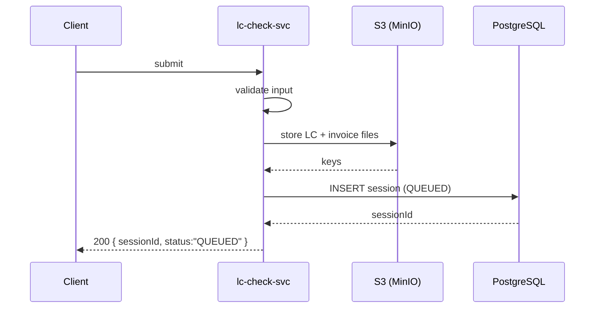
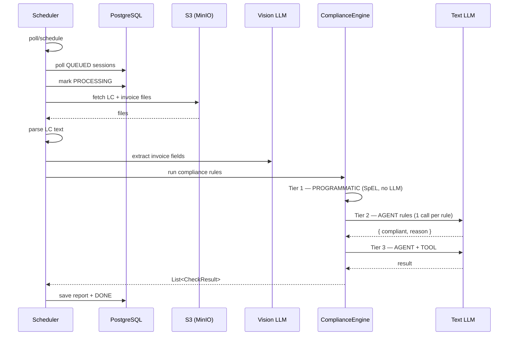
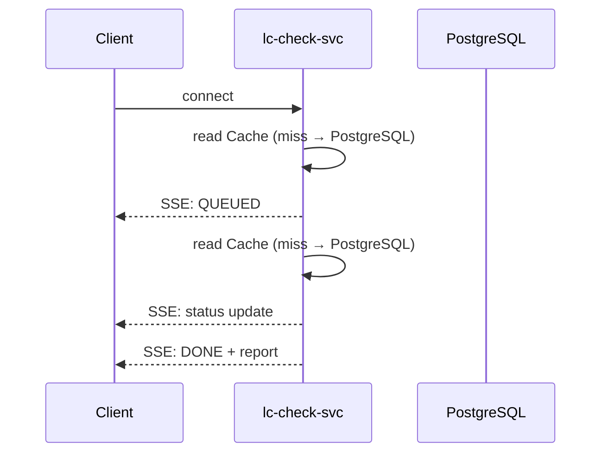

# LC Invoice Checker — Solution Document

---

## Major Considerations

### **Output Accuracy**

Accuracy is the most important consideration. Any missed issue means immediate financial loss — LC funds go to the beneficiary and cannot be recovered.

Hence each stage of **LLM agent output must be right.** Human review remains the final gate as LLM didn't reach that stage yet.

### **Workload Decoupling**

Banks have 5 days to check LC and invoice. But document submission can happen anytime, in any volume. Also the LLM inference engine have capacity and limits processing paralel request.

So **decouple submission from processing is needed.** This lets the system scale freely without concurrency failures.

### **Observation Capability**

The vision and language models are black boxes to us. We need to see what goes in and what comes out. That visibility is how we close the accuracy gap. Frameworks like SpringAI, LangChain are convenient — but they hide the details.

That's why we need to **inspect the raw LLM API request and response** for judging and tuning LLM Performance.

## Workflow

### 1. Task Submission

**API:** `POST /api/v1/lc-check/start` — submit LC text + invoice PDF, get sessionId immediately

### 2. LC Check Pipeline

**API:** async scheduler — polls queue, runs compliance checks, saves report

### 3. Progress Inquiry (SSE)

**API:** `GET /api/v1/lc-check/{sessionId}/stream` — live SSE stream of status and result

## Config-Driven Design

### **LC MT700 Parsing** 

We use the 2 files as gold source fields for validation and parse fields from MT700 txt for LC fields. any new fields definition can add there in the config.

- [`field-pool.yaml`](lc-checker-svc/src/main/resources/fields/field-pool.yaml): for definition  of LC fields and description.
- [`lc-tag-mapping.yaml`](lc-checker-svc/src/main/resources/fields/lc-tag-mapping.yaml): for mapping between MT700 tag to field-pool defination.

### **Invoice Extraction** 

We extract all invoice fields from fields-pool definition, inject all required fields and description into the vision extract prompt.

- [`field-pool.yaml`](lc-checker-svc/src/main/resources/fields/field-pool.yaml) : along with lc tag fields , invoice field share the same key in field-pool.yml as golden source.

- [`invoice-extract-vision.st`](lc-checker-svc/src/main/resources/prompts/extract/invoice-extract-vision.st): prompt template for vission llm extract invoice fields.  optimize needed for more accuracy extraction besides the model fine tuning part.  optimize this one first before model fine tuning.

### **Compliance Rules**

Rules are defined in [`catalog.yml`](lc-checker-svc/src/main/resources/rules/catalog.yml), driven by UCP 600 and ISBP 821. See [`ucp600_isbp821_invoice_rules.md`](docs/refer-doc/ucp600_isbp821_invoice_rules.md) — **Quick Cross-Reference Matrix** for full rule reference.

- [`catalog.yml`](lc-checker-svc/src/main/resources/rules/catalog.yml): defines rules at field level. Grouped by business phase: Parties, Money, Goods, Logistics, Procedural
  - **PROGRAMMATIC**: 4 rules — straightforward logic via SpEL, no LLM
  - **AGENT**: 12 rules — prompt-driven checks via [`prompts/check/`](lc-checker-svc/src/main/resources/prompts/check/) templates
  - **AGENT+TOOLS**: 2 rules — LLM calls Java tool for computation. [`prompts/check/`](lc-checker-svc/src/main/resources/prompts/check/) templates

## Deployment Architecture

## Performance and Optimization

### Overall performance

- Overall: 2 mins

- LC parse: < 1 seconds

- Invoice extract:
  - 30~40s: local qwen3-vl:4b mac book pro m1    
  - 10s: qwen-plus (Aliyun) as reference benchmark
- LC rule check: 3~4s by qwen3-vl:4b on  my local.    better performance via Text Model and GPU based server.

### Vision Model for Invoice Extraction

* Bigger size model like qwen3-vl: 7b or larger will result a better accuracy

* Prompt optimization further can improve the extract quality
* LoRA, QLoRA fine tuning can improve the quality. 
* Cross reference. Cross reference by different OCR source can ensure 

### Text Model for Rule Check

* Bigger Size model and GPU hosted server can result better performance

* Specific Rule Prompt template optimization will result accurate rule result and reason.

  pre-condition is OCR Extraction fields accuracy. 

* Fine tuning of the text model driven by UCP, ISBP rules and data 

